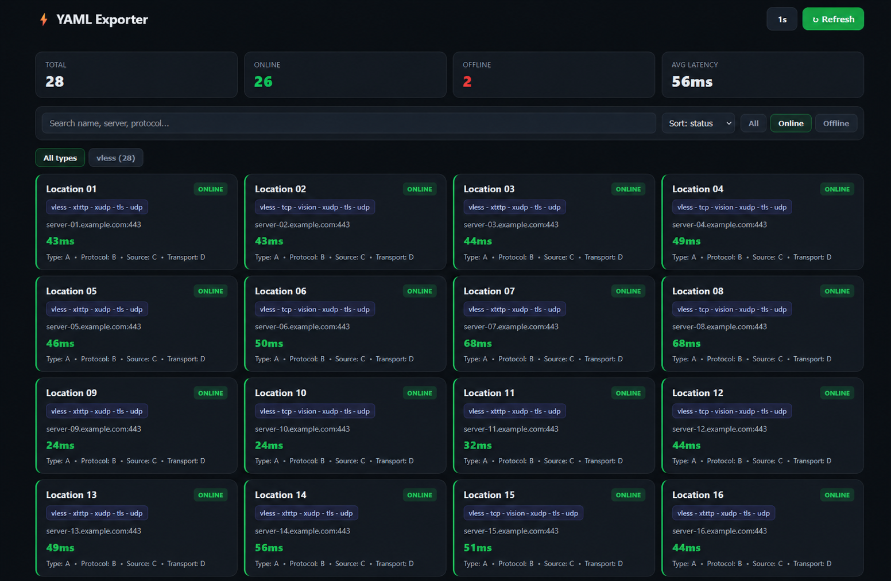

# mihomo-yaml-exporter



Prometheus exporter for [Mihomo](https://github.com/MetaCubeX/mihomo) / Clash-style YAML subscriptions. Fetches your subscription, resolves proxy groups (including nested groups), runs health checks, and exposes metrics plus a built-in status UI.

Published image: `ghcr.io/nemu-x/mihomo-yaml-exporter:latest`

## What it does

- Pulls YAML from `SUBSCRIPTION_URL` on a schedule and after manual refresh
- Expands `proxy-groups` (nested groups like auto-select pools are flattened to real nodes)
- Filters nodes by group names and optional regex on proxy names
- Checks each proxy:
  - **`mihomo` (default)** — embedded Mihomo core + `external-controller` delay test (same idea as the Mihomo app)
  - **`tcp`** — TCP/TLS reachability to `server:port` only
- Exposes Prometheus metrics with per-proxy labels
- Serves a dark web dashboard at `/` (search, filters, protocol tabs, manual refresh)

## Quick start

```bash
cp .env.example .env
# set SUBSCRIPTION_URL to your Mihomo/Clash subscription URL

docker compose up -d
```

Open `http://<host>:9123/` for the dashboard, or `http://<host>:9123/metrics` for Prometheus.

## Configuration

| Variable | Default | Description |
|----------|---------|-------------|
| `SUBSCRIPTION_URL` | *(required)* | Mihomo/Clash YAML subscription URL |
| `LISTEN_ADDR` | `0.0.0.0:9123` | HTTP listen address |
| `CHECK_MODE` | `mihomo` | `mihomo` or `tcp` |
| `CHECK_INTERVAL` | `60s` | Subscription refresh + check interval |
| `CHECK_TIMEOUT` | `10s` | Per-proxy check timeout |
| `CHECK_CONCURRENCY` | `5` | Parallel checks |
| `CHECK_RETRIES` | `2` | TCP mode only |
| `CHECK_TLS_PORTS` | `443,8443` | TCP mode: try TLS on these ports |
| `MIHOMO_DELAY_URL` | `http://www.gstatic.com/generate_204` | Delay-test target URL |
| `MIHOMO_CONTROLLER` | `http://127.0.0.1:9090` | Controller URL (in-container) |
| `MIHOMO_BINARY` | `/usr/local/bin/mihomo` | Path to mihomo binary |
| `MIHOMO_CONFIG_DIR` | `/tmp/mihomo` | Runtime config directory |
| `MIHOMO_STARTUP_TIMEOUT` | `45s` | Wait for controller after start/reload |
| `MIHOMO_SECRET` | *(empty)* | API secret if set in config |
| `INCLUDE_GROUPS` | *(empty = all)* | Comma-separated proxy-group names to monitor |
| `EXCLUDE_GROUPS` | `DIRECT,REJECT,GLOBAL` | Groups skipped when building the proxy list |
| `EXCLUDE_PROXY_REGEX` | *(empty)* | Drop proxies whose **name** matches |
| `INCLUDE_PROXY_REGEX` | *(empty)* | Keep only matching proxy names |

### Group filter examples

Monitor only specific pools (names must match your subscription):

```env
INCLUDE_GROUPS=Auto,Emergency,Country
EXCLUDE_GROUPS=DIRECT,REJECT,GLOBAL,No VPN
```

Empty `INCLUDE_GROUPS` means all proxies from the YAML (after excludes).

## HTTP endpoints

| Endpoint | Description |
|----------|-------------|
| `GET /`, `GET /ui` | Web dashboard |
| `GET /metrics` | Prometheus metrics |
| `GET /health` | JSON status (`ok` / `degraded`) |
| `GET /proxies` | JSON proxy list with last check results |
| `GET /api/meta` | Check interval and mode metadata |
| `POST /api/refresh` | Queue an immediate subscription fetch + check |

## Prometheus

### Scrape config

If the exporter runs via the included `docker-compose.yml` on the same Docker network as Prometheus:

```yaml
scrape_configs:
  - job_name: mihomo-yaml-exporter
    scrape_interval: 60s
    static_configs:
      - targets: ["mihomo-yaml-exporter:9123"]
```

On the host (published port `9123`):

```yaml
    static_configs:
      - targets: ["127.0.0.1:9123"]
```

### Metrics

| Metric | Labels | Description |
|--------|--------|-------------|
| `mihomo_proxy_up` | `name`, `type`, `server`, `port` | `1` if up, `0` if down |
| `mihomo_proxy_latency_ms` | `name`, `type`, `server`, `port` | Last check latency (ms) |
| `mihomo_proxy_check_timestamp` | `name`, `type`, `server`, `port` | Unix time of last check |
| `mihomo_subscription_load_success` | — | `1` if last subscription fetch/parse succeeded |
| `mihomo_subscription_last_success_timestamp` | — | Unix time of last successful fetch |
| `mihomo_proxy_total` | — | Monitored proxy count |
| `mihomo_proxy_online_total` | — | Proxies up on last check |
| `mihomo_proxy_offline_total` | — | Proxies down on last check |

### Example PromQL

```promql
# Availability (%)
100 * sum(mihomo_proxy_up) / count(mihomo_proxy_up)

# Proxies currently down
mihomo_proxy_up == 0

# Slowest nodes (ms)
topk(10, mihomo_proxy_latency_ms)

# Subscription unhealthy
mihomo_subscription_load_success == 0
```

## Grafana

1. Add Prometheus as a data source (if not already).
2. Create a dashboard with panels such as:
   - **Stat** — `sum(mihomo_proxy_online_total)` / `sum(mihomo_proxy_total)`
   - **Time series** — `mihomo_proxy_up` over time (legend: `{{name}}`)
   - **Table** — `mihomo_proxy_up`, `mihomo_proxy_latency_ms` with labels `name`, `type`, `server`
   - **Alert** — `mihomo_subscription_load_success == 0` or `sum(mihomo_proxy_up) == 0`

Point your Prometheus scrape (or Grafana Agent / Alloy `prometheus.scrape`) at port `9123`.

## Check modes

| Mode | When to use |
|------|-------------|
| `mihomo` | Default. App-like delay test through Mihomo (compatible CPU binary in the image). |
| `tcp` | Reachability only; no Mihomo process. |

## License

MIT
